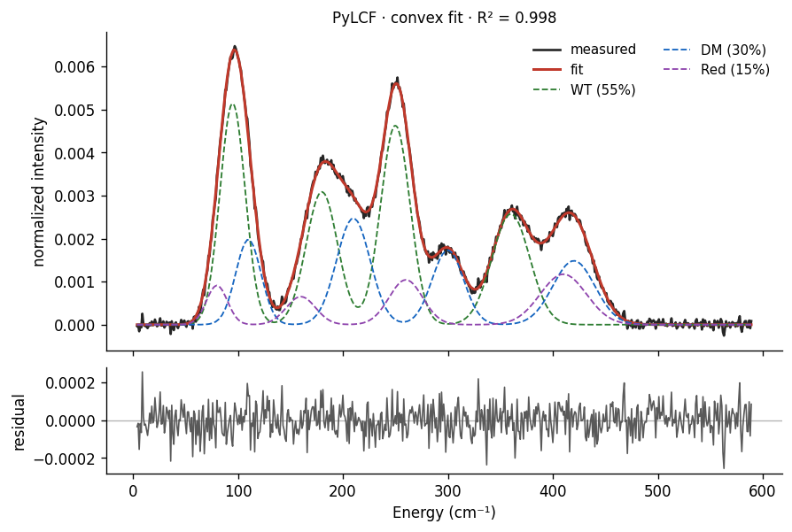
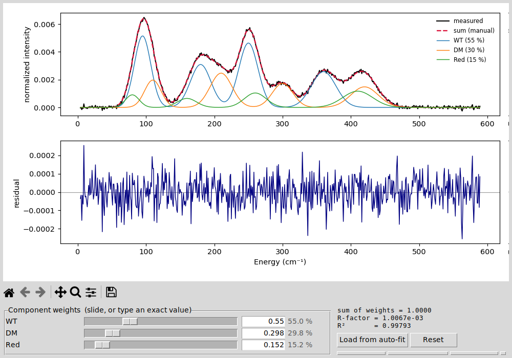

# PyLCF — Linear Combination Fitting (GUI)


**PyLCF** is a small desktop application — a Tkinter GUI with a matching command‑line interface — for **Linear
Combination Fitting (LCF)** of one‑dimensional data. It describes a measured
curve *y(x)* as a weighted sum of reference curves on a common x‑axis,

```
y_meas(x)  ≈  Σ wᵢ · yᵢ(x)
```

and finds the weights *wᵢ*. Nuclear‑Inelastic‑Scattering / NRVS spectra
decomposed into component PVDOS are the running example, but any data that is
plausibly a linear combination of references works just as well — XAS/XANES
LCF, diffraction patterns, chromatograms, kinetic traces, and so on.



## Features

- **GUI, no scripting required.** Everything is point‑and‑click.
- **Flexible data entry:** paste a table straight from Excel, import an
  `.xlsx`/`.xlsm` file (shared‑grid *or* XY‑pairs layout), import a whole folder
  of Excel files, or load two‑column text files (`.dat`/`.csv`/`.txt`).
- **Renameable spectra:** double-click a loaded spectrum to rename it (unnamed ones are numbered automatically); the last folder and your option settings are remembered between sessions.
  References may live on **different x‑grids** — they are interpolated onto the
  common overlap automatically (no extrapolation).
- **Three fit modes:** `convex` (weights ≥ 0 and sum = 1 → population
  fractions), `nnls` (weights ≥ 0), `linear` (unconstrained).
- **Normalization:** `area` / `max` / `none`, with an optional fit window.
- **Honest uncertainties:** residual **bootstrap** with 95 % confidence
  intervals, plus a **block bootstrap** for the correlated residuals typical of
  spectra.
- **Component significance:** a **drop‑one F‑test** marks which references are
  justified — reported together with the residual autocorrelation and the
  *effective* sample size, so the p‑values are read as a relative guide.
- **Δx weighting (optional):** weight each point by its x‑spacing so the fit
  approximates the integral and no longer depends on sampling density — useful
  for uneven grids.
- **Interactive overlay:** one slider per reference to explore the mixture by
  eye, with live fractions and live R‑factor / R².
- **Export:** `.dat`/`.csv` (with a provenance comment header), `.xlsx`,
  `.json`, and the plot (`.png`/`.pdf`/`.svg`); plus a one‑click *Copy results*. The x-axis column name in the data exports is configurable (`--xname` / GUI field).
- **Bilingual manuals** (English + German) in [`docs/`](docs).

### Interactive overlay

Open *“Interactive overlay”* to scale each reference with a **slider** (or type
an exact value); the overlaid sum, the live fractions and the live
R‑factor / R² update in real time:



## Installation

Requires **Python ≥ 3.9**.

```bash
git clone https://github.com/lknauer/pylcf.git
cd pylcf
pip install -r requirements.txt
```

On Linux, Tkinter may need a system package (it ships with the python.org
builds on Windows/macOS):

```bash
sudo apt install python3-tk
```

Optionally install it as a command:

```bash
pip install .
pylcf
```

## Quick start

Run the GUI straight from the repository (no installation needed):

```bash
python -m pylcf
```

After `pip install .` the same GUI is available as the `pylcf` command, and a
command‑line interface as `pylcf-cli` (or `python -m pylcf.cli`), e.g.:

```bash
pylcf-cli --measured spectrum.dat --sub refA.dat refB.dat --mode all --ftest
```

Add `--xlsx` for an Excel workbook (summary + fit sheets) and `--xlabel`/`--ylabel` to set the plot labels; `--csv` writes comma-separated data, `--quiet` silences output, and `pylcf-cli --help` lists every option.

Then try the bundled examples in [`examples/`](examples):

- **Paste:** open `examples/paste_table.txt`, copy the columns, and use
  *“Paste table …” → “Paste from clipboard”*.
- **Excel (shared grid):** *“Excel file …”* → `examples/shared_grid.xlsx`.
- **Folder:** *“Excel folder …”* → `examples/folder/` (one measured spectrum
  plus three references, deliberately on **different grids**).

A typical workflow: add a measured spectrum and at least one reference, choose a
mode and normalization, optionally set a fit window, then click **Run fit**.
(Press **F5** to fit, **Ctrl+S** to export, **Ctrl+O**/**Ctrl+P** to import.)

## How the fit works — and what to trust

PyLCF minimizes `Σ (y_meas − Σ wᵢ yᵢ)²` on the measured grid within the
references’ overlap; references are interpolated onto that grid. A few notes
that matter for interpretation:

- The plain bootstrap assumes **independent** residuals. Spectral residuals are
  correlated, so its intervals are optimistic — turn on **Block bootstrap** for
  more honest (usually wider) intervals. These are *percentile* bootstrap
  intervals; a weight pinned at the 0 boundary (`nnls`/`convex`) piles up
  there, so its std is not meaningful and the component is flagged `~0`.
- The F‑test shares that assumption. PyLCF therefore reports the residual
  lag‑1 autocorrelation and the **effective sample size**, and treats the
  p‑values as a *relative* guide (rigorous for `linear`, approximate for
  `nnls`/`convex`); it now also shows an effective-N p-value corrected for
  that autocorrelation, and writes both p-values, the autocorrelation and the
  effective N into the `.dat`/JSON/Excel exports. The bootstrap CI is the
  more trustworthy uncertainty.
- Without Δx weighting the R‑factor depends on sampling density on uneven
  grids; **Δx weighting** makes the fit sampling‑invariant.

The GUI and the command‑line interface share the same numeric core
([`pylcf/core.py`](pylcf/core.py)), so their results are identical by
construction (with Δx weighting off, which is the default).

## Tests

```bash
python tests/test_features.py     # numeric core + features (no display needed)
python tests/test_overlay.py      # GUI tests (need a display)
python tests/test_slider.py       # GUI tests (need a display)
```

or run them with `pytest tests/`. The GUI tests require a display; on a
headless machine prefix them with `xvfb-run -a`.

## Documentation

Full manuals — in **English** (`docs/USERGUIDE_EN.pdf`) and **German**
(`docs/ANLEITUNG.pdf`) — cover every option with worked examples.

## Related software

LCF is well established, mostly in X‑ray absorption spectroscopy: **ATHENA**
(Demeter/IFEFFIT) and **Larch** (XAS Viewer / Larix) provide GUI XANES LCF.
PyLCF’s niche is being lightweight, standalone and **not XAS‑specific** (any
1‑D data), with automatic handling of different grids, convex/nnls/linear fits,
bootstrap and F‑test diagnostics, and very easy Excel data entry.

## Citing

If PyLCF is useful in your work, please cite it via GitHub’s *“Cite this
repository”* button (generated from [`CITATION.cff`](CITATION.cff)). Method
references are listed there and in the manuals.

## Contributing

Contributions are welcome — please see [`CONTRIBUTING.md`](CONTRIBUTING.md) and
the [code of conduct](CODE_OF_CONDUCT.md). Run `pytest` and `ruff check .`
before opening a pull request; continuous integration runs both on every push.

## License

MIT — see [`LICENSE`](LICENSE).
© 2026 Lukas Knauer (AG Schünemann, RPTU Kaiserslautern‑Landau).
